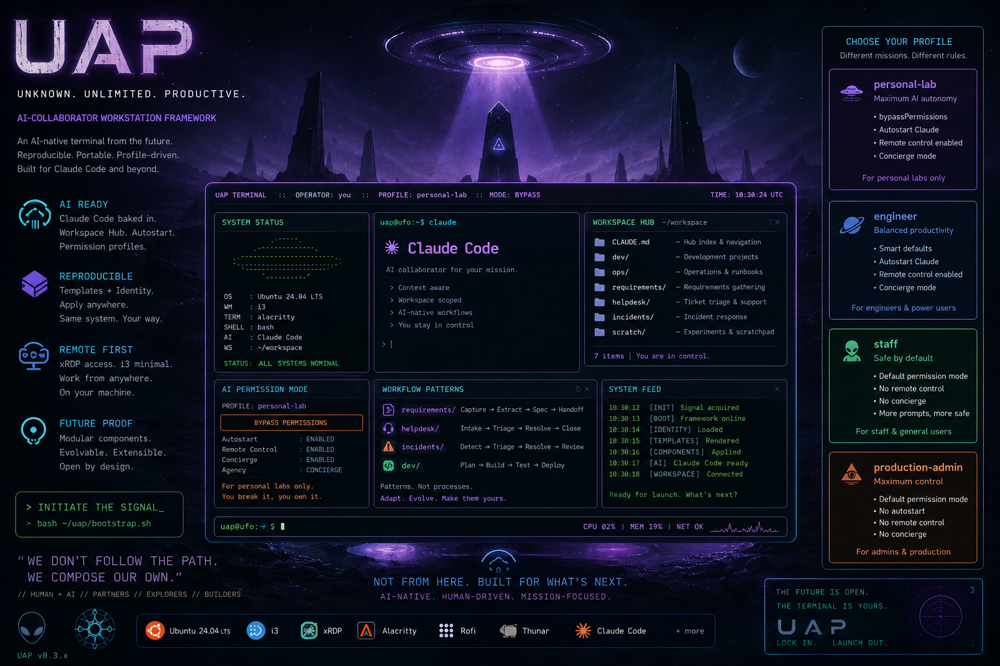

# UAP — an AI-collaborator workstation framework

> *out of this world*



UAP turns a fresh Ubuntu Server install into a quiet, dark, keyboard-driven workstation you log into remotely — and that has an AI agent in the session with you from the first keystroke. Open source, MIT-licensed, parameterized so any operator can fork it and stand up an identical machine in minutes.

**What you actually get:**

- Ubuntu Server 24.04 LTS + i3 + xrdp (you RDP in from your laptop or phone, you don't sit at the box)
- Tokyo Night theme across the whole stack (i3 bar, WezTerm, alacritty, rofi, Typora, GTK apps, the boot splash)
- Claude Code installed and auto-starting in a `~/workspace/` hub, with four built-in permission tiers (`personal-lab`, `engineer`, `staff`, `production-admin`)
- Optional second surface for the same assistant on Telegram via [Hermes Agent](https://hermes-agent.nousresearch.com/) (recommended), sharing the workspace-hub knowledge layer with Claude Code so you can jump between terminal and phone without re-explaining context
- The toolchain a dev needs out of the box: Edge, Chrome, btop, bat, glow, Typora, git, build essentials

**What's different about it:**

- **AI-collaborator first.** Terminal autostart, workspace hub, permission-tier `~/.claude/settings.json`s are designed around having a Claude session in the room with you — not bolted on after the fact.
- **Identity-driven & reproducible.** Everything that makes a machine *yours* (hostname, theme, `components_enabled`, operator email) lives in `~/uap.local/identity.yaml`, not in this repo. Fork → set identity → `apply.sh`. Same identity on another machine = the same workstation.
- **Unopinionated about what work you bring.** UAP wires the box for AI-collaborator use; what you put in `~/workspace/` is up to you. If you want a folder-as-workflow methodology, [`setup/references.md`](setup/references.md) links to one approach (ICM), but it's optional.

Working today. PRs and issues welcome. See [`setup/DESIGN.md`](setup/DESIGN.md) for architecture, [`CONTRIBUTING.md`](CONTRIBUTING.md) to contribute.

## Quick Start

You have a fresh **Ubuntu Server 24.04 LTS** install (VM or bare metal) reachable over SSH or local console. UAP turns it into your AI-collaborator workstation.

**One-liner from the public repo:**

```bash
bash <(curl -fsSL https://raw.githubusercontent.com/subhas85/uap/main/bootstrap.sh)
```

**Or, clone first** (recommended — lets you inspect what you're about to run, and the repo ends up at `~/uap` where the rest of the framework expects it):

```bash
git clone https://github.com/subhas85/uap.git ~/uap
bash ~/uap/bootstrap.sh
```

**Pointing an AI agent at it:** Once you've SSHed into the box, install Claude Code (`curl -fsSL https://claude.ai/install.sh | bash`), launch Claude from your home directory, and tell it: *"This is a fresh Ubuntu Server 24.04. Clone github.com/subhas85/uap into ~/uap, run bootstrap.sh, and help me through the wizard it launches."* The agent prepares the box and hands you off to the wizard, where it can continue helping you answer questions.

What `bootstrap.sh` does:

1. Sanity-checks the OS, refuses root.
2. Installs minimal apt prereqs (`git`, `curl`, `ca-certificates`).
3. Installs the Claude Code CLI (`curl https://claude.ai/install.sh | bash`) and persists `~/.local/bin` on `PATH` for future shells.
4. Ensures the UAP repo is at `~/uap/` (clones from `REPO_URL` if not).
5. Launches `claude` in `~/uap/setup/` — at which point the **deployment wizard** takes over.

The wizard offers two paths:

- **Simple** (recommended for first-timers) — one question: which of four built-in profiles to install (`personal-lab`, `engineer`, `staff`, `production-admin`). The wizard auto-detects your username and hostname, asks for your email, copies the chosen profile to `~/uap.local/identity.yaml`, and runs `apply.sh`. ~30 seconds. To customize anything after install, edit `~/uap.local/identity.yaml` and rerun `apply.sh`.
- **Advanced** — walks the full `setup/QUESTIONNAIRE.md` so you can pick each piece (browsers, modifier key, workspace count, theme, etc.). Use this when you want to deviate from defaults during install rather than after.

Once the wizard finishes, RDP to the box from your laptop or phone over your tailnet and you should be on the UAP desktop.


## Minimum specs

| Tier | CPU | RAM | Disk | Real-world feel |
|---|---|---|---|---|
| Absolute min | 2 vCPU | 2 GB | 25 GB | Boots and RDP works; browsers swap heavily |
| Comfortable | 2 vCPU | 4 GB | 30 GB | Single browser, terminal, Typora — fine for sysadmin work |
| **Recommended** | 4 vCPU | 8 GB | 40 GB | Edge + Chrome both running, multiple terminals, Claude Code happy |
| Reference build | 4–8 vCPU | 16 GB | 60 GB+ | Headroom for AI tooling, containers, many tabs |

Browsers (especially Chrome with AI browser-automation extensions) are the dominant RAM consumer; if you'll use UAP as an AI-collaborator workstation, plan for 8 GB minimum.

## How AI-driven installs work

UAP's automation starts once Ubuntu Server is running and reachable. **Provisioning the VM (or burning the ISO for bare-metal) is the operator's job today** — install Ubuntu Server 24.04 LTS via your hypervisor's normal flow or a USB stick, get network access, then point an AI agent at this repo. From that moment forward the agent drives everything: clones the repo, runs `bootstrap.sh`, walks you through the wizard, and applies the result.

Future work — fully hands-off provisioning from a hypervisor API (e.g., Proxmox `pvesh` + cloud-init autoinstall) is on the roadmap but not in this release. If you want to contribute that piece, see `CONTRIBUTING.md`.

## What you get

- Ubuntu Server 24.04 LTS as the base
- xrdp + xorgxrdp for RDP access (Tailscale-friendly)
- i3 window manager (Tokyo Night theme, JetBrainsMono Nerd Font)
- WezTerm + Alacritty terminals, rofi launcher, flameshot screenshots, feh wallpaper, thunar file manager
- Browsers: Microsoft Edge, Google Chrome, Chromium (snap), Firefox (snap)
- Markdown editor: Typora (with Tokyo Night theme installed)
- Terminal tools: btop, bat, glow (markdown viewer)
- A small daemon that puts the active window title next to the workspace number on the i3 top bar
- System-wide dark mode (Adwaita-dark for GTK apps; Qt apps follow GTK)
- Custom Plymouth boot splash (UAP logo on Tokyo Night background — visible on hypervisor console / bare-metal display)
- **Optional Telegram surface:** [Hermes Agent](https://hermes-agent.nousresearch.com/) (Nous Research, MIT) is the recommended way to reach the same assistant from your phone. Hermes runs as a systemd service, shares `~/workspace/CLAUDE.md` and `~/.hermes/SOUL.md` + memories with Claude Code, and is documented as a UAP component at `ai/hermes-agent/`.
- Optional admin-tooling components you can swap for your own — the bundled example, `m365-admin-tools`, installs PowerShell + the `MicrosoftTeams` module for operators who manage a Microsoft 365 tenant; drop it if you don't.

## Layout of this folder

```
bootstrap.sh                    # kickstart entry point — installs Claude, launches wizard
setup/                          # deployment engine
  QUESTIONNAIRE.md              # source-of-truth list of questions for a new operator
  apply.sh                      # renders templates from identity.yaml and installs each component
  answers.example.yaml          # shape of the identity file (~/uap.local/identity.yaml)
  DESIGN.md                     # design notes for the deployment system
  references.md                 # links to ICM paper, upstream docs, known issues
profiles/                       # pre-canned identity.yaml files (skip the wizard if one fits)
  personal-lab.yaml             # bypass allowed; isolated experiments
  engineer.yaml                 # prompt before tool use; daily work with some sensitive context
  staff.yaml                    # prompts on, no concierge / remote-control; non-technical users
  production-admin.yaml         # prompts on, no autostart; high-stakes access (servers, cloud tenants, client data)
os/                             # system chrome — what Ubuntu looks like
  i3/, alacritty/, wezterm/, rofi/, xinitrc/, typora-themes/
  gtk-theme/, plymouth/, xrdp/, workspace-title-daemon/
  m365-admin-tools/             # PowerShell + Teams Phone admin module
ai/                             # AI-assistant-facing pieces
  workspace-hub/                # ~/workspace/CLAUDE.md router template (ICM Layer 0)
  desktop-entries/              # rofi launcher + icon for "Claude (workspace)"
  hermes-agent/                 # Optional Telegram surface — install + SOUL.md / USER.md / MEMORY.md / systemd drop-in
workflows/                      # reusable workflow patterns (each with its own CLAUDE.md)
  dev/, helpdesk/, incidents/, requirements/
```

Files ending in `.tmpl` under `os/`, `ai/`, and `workflows/` are envsubst templates rendered by `setup/apply.sh` from `~/uap.local/identity.yaml`. Files without `.tmpl` are copied verbatim. See `setup/DESIGN.md` for the deployment contract.

## How it works, in one minute

```
fork → set identity.yaml → apply.sh → RDP in
```

1. **One identity file.** Everything that makes a machine yours — hostname, theme, which components to install, operator email — lives in `~/uap.local/identity.yaml`, outside this repo. Pick a profile or answer the wizard.
2. **`apply.sh` renders + installs components.** Each piece of the desktop (`i3`, `wezterm`, `rofi`, `xrdp`, `gtk-theme`, `workspace-hub`, …) is a self-contained component. `apply.sh` renders its templates from your identity and installs it. Run all of them, or one at a time.
3. **RDP in.** From your laptop or phone over your tailnet, you land on the Tokyo Night desktop with a Claude Code session already open in `~/workspace/`.

Same `identity.yaml` on another box = the same workstation. That reproducibility — not the apt list — is the point.

## Full install runbook

The quick start above is the fast path. If you want to understand or run the install **phase by phase** — provisioning, package install, xrdp tuning, each component, and every known issue baked into the configs — see **[`docs/RUNBOOK.md`](docs/RUNBOOK.md)**.

- Architecture & the `identity.yaml` schema → [`setup/DESIGN.md`](setup/DESIGN.md)
- Contributing → [`CONTRIBUTING.md`](CONTRIBUTING.md)
- ICM (the optional folder-as-workflow methodology) & upstream docs → [`setup/references.md`](setup/references.md)

